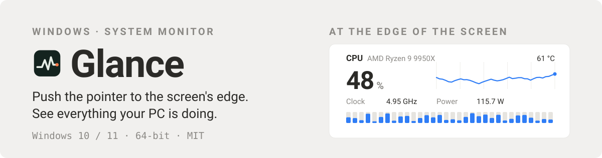
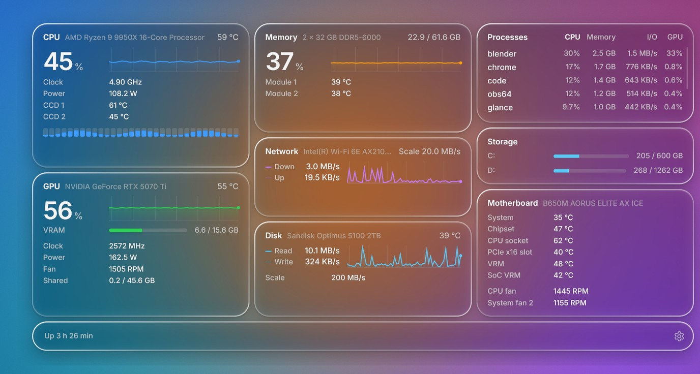
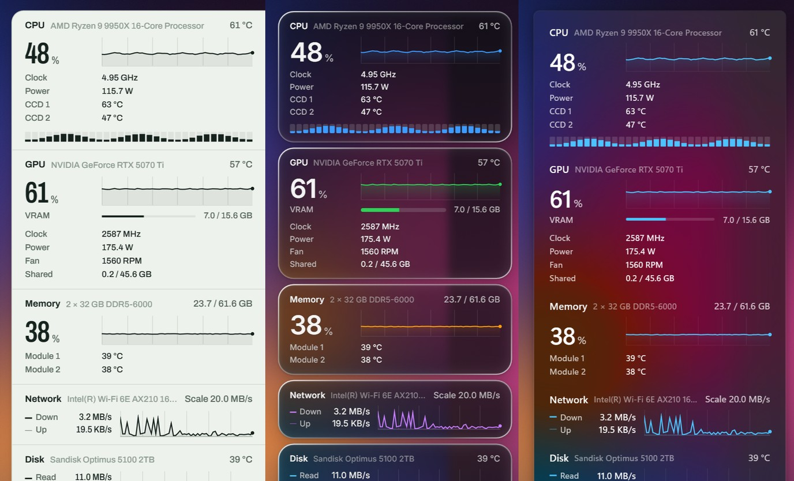

<picture>
  <source media="(prefers-color-scheme: dark)" srcset="docs/readme/hero-en-dark.svg">
  
</picture>

[](#licence)
[](https://github.com/lulu-loopp/glance/releases/latest)
[](https://github.com/lulu-loopp/glance/releases)
[](#install)

Glance is a free, open-source system monitor for Windows that stays out of
the way. Push the pointer against the edge of the screen and a panel slides
out with everything your PC is doing; move away and it slides back.

[中文说明](README.zh-CN.md) · [Download](https://github.com/lulu-loopp/glance/releases/latest) · [Hardware](#hardware) · [Build](#build)



## What it shows

- **CPU**: usage, every thread, clock, temperature, package power, each chiplet's temperature
- **Graphics**: usage, video memory, clock, temperature, fan, and the card's power on NVIDIA and AMD cards
- **Memory**: use, and each module's temperature
- **Network and disk**: traffic, and the drive's temperature
- **Processes**: the busiest programs by CPU, memory, I/O or GPU
- **Storage**: space on each drive
- **Motherboard**: temperatures and fan speeds
- **Battery**, on laptops

## Three looks

Chart paper, frosted glass (the desktop behind bends at the rim of each
piece) and Windows 11 (acrylic, as the Start menu draws it). Light or dark,
or following the brightness of your wallpaper. Chinese or English.



## Small and quiet

One executable of about 1 MB, drawn natively with Direct2D and
DirectComposition. About 55 MB of memory and well under 1% of a CPU core
while the panel is hidden. No network access, no account, no ads.

## Install

1. Download `Glance_<version>_x64-setup.exe` from the
   [latest release](https://github.com/lulu-loopp/glance/releases/latest) and run it.
2. The installer is signed (publisher: Weiyi Shi). As the signature is new,
   Windows SmartScreen may still say "Windows protected your PC" for the first
   downloads; choose **More info → Run anyway**.
3. Glance asks for administrator rights once, on its first start: reading
   temperatures, power and fans needs them, through the signed
   [PawnIO](https://github.com/namazso/PawnIO) driver the installer sets up.
   After that it starts without asking, and can start with Windows.

**Where to install.** Glance starts with administrator rights without asking
only from a folder no ordinary program can change: Program Files (the
default), or a new folder at the root of a drive, such as `D:\Glance`. The
installer explains if you choose somewhere else; installed there, Glance asks
for administrator rights at every start and cannot start with Windows.

## Use

- **Open the panel**: push the pointer against the screen's right edge (the
  edge, the push needed and where the panel appears are in the settings). It
  opens over fullscreen apps too. A deliberate push is needed, so scroll bars
  at the edge stay usable.
- **Close it**: move the pointer away.
- **Settings**: right-click the tray icon, or start Glance again. The settings
  window works with the keyboard as well (Tab, the arrow keys, Space).
- **Uninstall**: from Windows' Apps list, or from the settings. It removes
  Glance, its scheduled tasks and its settings, and asks whether to remove the
  PawnIO driver too (other monitoring tools may use it).

## Hardware

| | Supported | Tried on real hardware |
|---|---|---|
| CPU | AMD Ryzen (Zen and later), Intel Core | AMD Ryzen 9 9950X |
| Motherboard sensors | ITE and Nuvoton Super I/O chips | ITE IT8689E |
| Memory temperature | DDR4 and DDR5 modules with a sensor | DDR5 |
| Graphics power | NVIDIA (NVML), AMD (ADL) discrete cards | NVIDIA RTX 5070 Ti |
| Everything else | through Windows (the sources Task Manager uses) | |

Reports from Intel and Nuvoton machines are welcome. On laptops, fans and
board temperatures belong to the laptop's embedded controller and are not
shown; integrated graphics draw from the CPU package, whose power the CPU
lane shows.

## Build

```
cargo build --release
makensis installer\glance.nsi
```

`scripts\release.ps1` does both; with `-Sign` it signs the executable, the
uninstaller and the installer (`scripts\sign.ps1`, Microsoft Artifact
Signing). A debug build runs without asking for administrator rights, and so
without the driver's sensors.

The pictures here and the promotional video are drawn by Glance itself:
`cargo build --release --features studio` adds `glance --studio script.json
out-folder`, which renders the panel off screen, frame by frame, from a
script of shots (`studio\`).

## Licence

Glance is released under the MIT licence ([LICENSE](LICENSE)). It ships with
and builds in third-party software under its own licences: the PawnIO driver
setup (GPL-2.0 with an exception; its source is attached to every release),
the PawnIO modules (LGPL-2.1, with their source in `pawnio-modules/source`),
the Archivo and Inter fonts (OFL 1.1) and Rust crates; see
[licenses/THIRD-PARTY.txt](licenses/THIRD-PARTY.txt).
