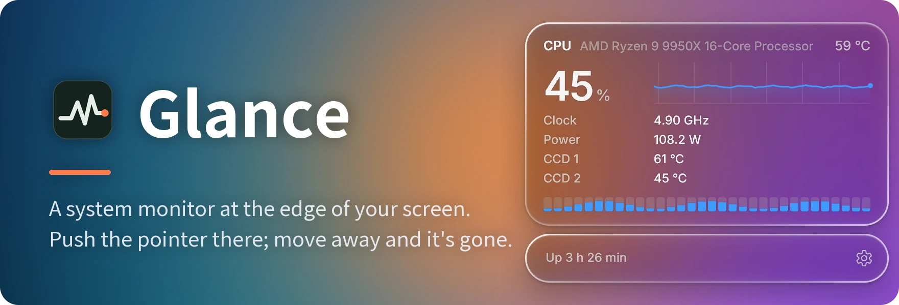
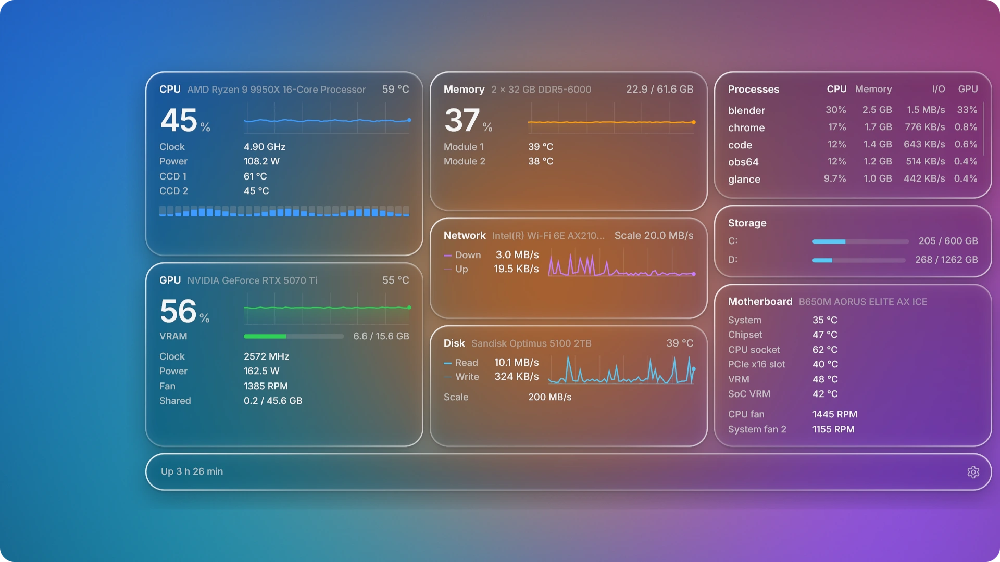
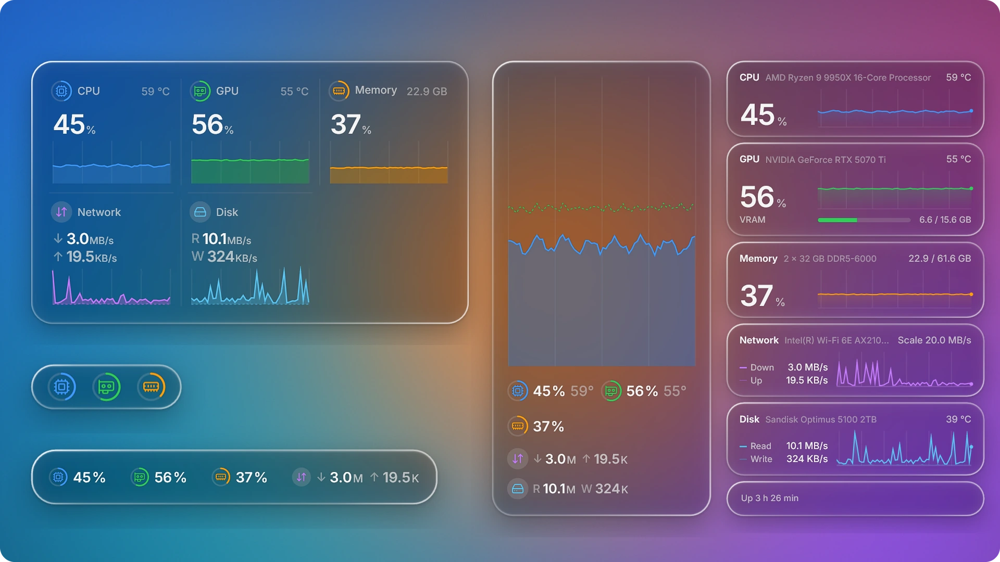
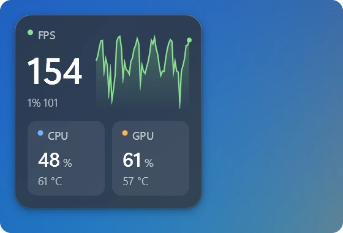
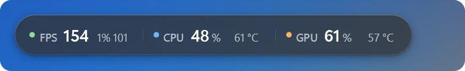
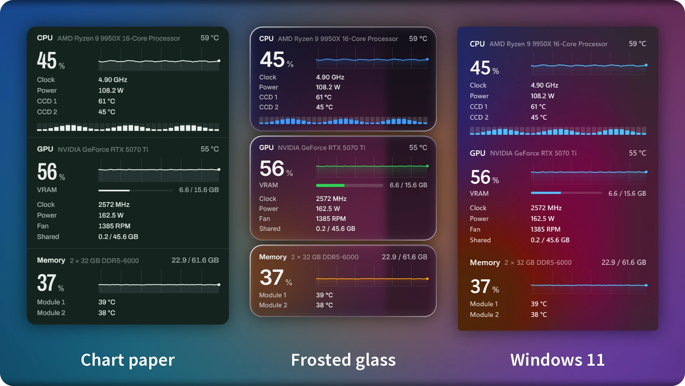

[](#licence)
[](https://github.com/lulu-loopp/glance/releases/latest)
[](https://github.com/lulu-loopp/glance/releases)
[](#install)

Glance is a free, open-source system monitor for Windows that stays out of
the way. Push the pointer against the edge of the screen and a panel slides
out with everything your PC is doing; move away and it slides back.

[Website](https://glancepc.com/en/) · [中文说明](README.zh-CN.md) · [Download](https://github.com/lulu-loopp/glance/releases/latest) · [Hardware](#hardware) · [Build](#build)



## What it shows

- **CPU**: usage, every thread (point at one for its clock), clock (each kind's on processors with big and little cores), temperature, package power, each chiplet's temperature
- **Graphics**: usage, video memory, clock, temperature, fan, and the card's power on NVIDIA and AMD cards
- **Memory**: use, its speed (and what the modules are rated for, if it runs below that), and each module's temperature
- **Network and disk**: traffic, and the drive's temperature
- **Processes**: the busiest programs by CPU, memory, I/O or GPU
- **Storage**: space on each drive
- **Motherboard**: temperatures and fan speeds
- **Battery**, on laptops: its charge, the power going in or out (on battery, what the whole machine draws) and its health
- **WSL and Docker**, for developers (off until chosen, under *More modules*): WSL 2's processors, memory and GPU and the distributions running, read from Windows alone so that no distribution is started or kept running; the containers Docker's current engine runs, each with its processors, memory, network and disk
- **Games**: while a fullscreen game runs, at the top: its frame rate, 1% low, a chart of its frame times and the screen's refresh rate; the game's own CPU, GPU, memory and video memory; whether the graphics card is held back by its power or temperature limit (NVIDIA); how long you have played; and whether your microphone is muted

## Desktop widgets

Drag the panel away from the edge and it tears off as a widget that stays on
the desktop. Size it by any edge or corner and it lays itself out for the
room: the panel's lanes, tiles, a chart with the figures beneath, a strip,
or a few rings, each turning smoothly into the next. Bring it near an edge of
the screen and it shows where it would sit; let go and it sits there as a
slim strip or rail, centred where you left it. Throw it off the screen to put
it away (the tray icon's menu brings it back). Hover over it for its buttons:
the game readings now (for a game Glance does not recognise as one), the
settings, a pin that locks its place and size, and close. Right-click it to
let clicks through to what is behind (hold Ctrl to handle it), to keep it
on the desktop under your windows rather than above them (Win+D shows it with
the desktop), to put it away, or for the settings. Widgets come back where you left them when Glance
starts, in the panel's look.



## The overlay

A few readings floating over the screen, all the time or only while a game
runs. Laid out as a card (the frame rate large, its
last minute charted beside it, the rest in tiles) or as a strip of one to
three rows, on frosted glass: the screen behind is blurred, and the glass is
tinted dark or light by what is around it, just enough for every figure to
read (on Windows 10 it is tinted, not blurred). Drag it into place, drag its
edges to size it, right-click it to lock it or close it. Choose what it shows
group by group, as for the panel (frame rate, CPU, GPU, memory, video memory,
download and upload, microphone), each group's figures one by one, and drag
the groups into the order you want.





Frames are counted from Windows' own event tracing: nothing is injected into
a game and its process is never opened, so anti-cheat has nothing to object
to. Games using DirectX are covered; Vulkan and OpenGL games show no frame
rate yet.

## Three looks

Chart paper, frosted glass (the desktop behind bends at the rim of each
piece) and Windows 11 (acrylic, as the Start menu draws it). Light or dark,
or following the brightness of your wallpaper. Chinese or English.



## Small and quiet

One executable of about 1 MB, drawn natively with Direct2D and
DirectComposition. About 55 MB of memory and well under 1% of a CPU core
while the panel is hidden. No account, no ads, and no network access but
one daily question to GitHub and Gitee about a newer version, which the
settings can turn off.

## Install

1. Download `Glance_<version>_x64-setup.exe` from the
   [latest release](https://github.com/lulu-loopp/glance/releases/latest) and run it
   (the same installer is mirrored on [Gitee](https://gitee.com/lulu-loopp/glance/releases)
   for mainland China).
2. The installer is signed (publisher: Weiyi Shi). As the signature is new,
   Windows SmartScreen may still say "Windows protected your PC" for the first
   downloads; choose **More info → Run anyway**.
3. Glance asks for administrator rights once, on its first start: reading
   temperatures, power and fans needs them, through the signed
   [PawnIO](https://github.com/namazso/PawnIO) driver the installer sets up.
   After that it starts without asking, and can start with Windows.

**Where to install.** Glance starts with administrator rights without asking
only from a folder no ordinary program can change: Program Files (the
default), or a new folder at the root of a drive, such as `D:\Glance`. The
installer explains if you choose somewhere else; installed there, Glance asks
for administrator rights at every start and cannot start with Windows.

## Use

- **Open the panel**: push the pointer against the screen's right edge (the
  edge, the push needed, where the panel appears, how many columns it takes
  and how large it is are in the settings, and pushing can be turned off).
  A deliberate push is needed, so scroll bars at
  the edge stay usable. Or press **Ctrl+Alt+G** (or a shortcut of your own),
  which opens it at the pointer and closes it again.
- **Games**: while a fullscreen game runs, a Game lane comes at the top of
  the panel; for its frame rate over the game itself, turn on "Show while
  playing" on the settings' Overlay page. Over a fullscreen game, borderless
  or exclusive, the settings choose what may open the panel (the shortcut
  only, by default: a push into the edge may be an accident mid-game). A game
  set to exclusive "Fullscreen" steps out while anything shows over it, as
  Windows works, and comes back when the panel closes; windowed games are
  covered as anything else is.
- **Choose what it shows**: in the settings, each module (CPU, each graphics
  card, memory, network, disk…) opens to its own items, each switched on or
  off; drag modules to change their order. WSL and Docker are folded away
  under *More modules* until switched on.
- **Close it**: move the pointer away, or press Esc.
- **Fix the display**: turn on Fixed display in Settings → Opening, then
  choose a Windows display. Off by default, the panel follows the mouse.
  When on, the shortcut and tray open on the chosen display, and
  pushing the edge works only on that display. Moving outward across a shared
  edge opens immediately, unless edge opening is off. A disconnected display falls
  back to the primary until reconnected. Desktop widgets can still move independently.
- **Size it**: drag the panel's edges, as soon as it opens.
- **Keep it on the desktop**: drag the panel away from the edge and it tears
  off as a widget (see [Desktop widgets](#desktop-widgets)), onto another
  screen too.
- **Pin it**: the pin in its bottom bar keeps it open while you work elsewhere, and open again when Glance starts.
- **At a glance**: hovering over the tray icon shows the CPU, graphics and
  memory in brief. A heat alert (off unless you turn it on) tells from the
  tray when the CPU or a graphics card stays at the temperature alert for
  30 seconds.
- **Settings**: right-click the tray icon, or start Glance again. The settings
  window works with the keyboard as well (Tab, the arrow keys, Space).
- **Update**: once a day Glance asks GitHub, and its mirror on Gitee, for a
  new version, using whichever it can reach. When one is out, the tray says
  so and the settings offer it. Glance downloads the installer and runs it only if it is signed
  by the same publisher as the Glance you have.
- **Uninstall**: from Windows' Apps list, or from the settings. It removes
  Glance, its scheduled tasks and its settings, and asks whether to remove the
  PawnIO driver too (other monitoring tools may use it).

## Hardware

| | Supported | Tried on real hardware |
|---|---|---|
| CPU | AMD Ryzen (Zen and later), Intel Core | AMD Ryzen 9 9950X |
| Motherboard sensors | ITE and Nuvoton (NCT67xx, and the NCT6683/6686/6687 on most MSI boards) Super I/O chips | ITE IT8689E |
| Memory temperature | DDR4 and DDR5 modules with a sensor | DDR5 |
| Graphics power | NVIDIA (NVML), AMD (ADL) discrete cards | NVIDIA RTX 5070 Ti |
| Everything else | through Windows (the sources Task Manager uses) | |

Reports from Intel and Nuvoton machines are welcome: **Settings → System →
Diagnostics → Copy** puts what Glance found on your machine, and which readings it gets,
on the clipboard, with the latest lines of its log, ready to paste into an
issue (no paths or names in it). The log itself is `glance.log`, beside the
settings in `%APPDATA%\dev.weiyi.glance`. On laptops, fans and
board temperatures belong to the laptop's embedded controller and are not
shown, except an ASUS laptop's fans, which its firmware reports; integrated graphics draw from the CPU package, whose power the CPU
lane shows.

## Build

```
cargo build --release
makensis installer\glance.nsi
```

`scripts\release.ps1` does both; with `-Sign` it signs the executable, the
uninstaller and the installer (`scripts\sign.ps1`, Microsoft Artifact
Signing). A debug build runs without asking for administrator rights, and so
without the driver's sensors.

The pictures here and the promotional video are drawn by Glance itself:
`cargo build --release --features studio` adds `glance --studio script.json
out-folder`, which renders the panel off screen, frame by frame, from a
script of shots; `studio\readme.py` and `studio\compose.py` put the frames
together (`studio\`).

## Licence

Glance is released under the MIT licence ([LICENSE](LICENSE)). It ships with
and builds in third-party software under its own licences: the PawnIO driver
setup (GPL-2.0 with an exception; its source is attached to every release),
the PawnIO modules (LGPL-2.1, with their source in `pawnio-modules/source`),
the Archivo and Inter fonts (OFL 1.1) and Rust crates; see
[licenses/THIRD-PARTY.txt](licenses/THIRD-PARTY.txt).
