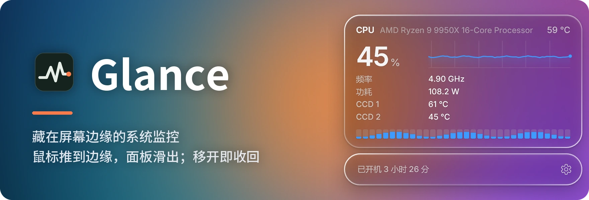
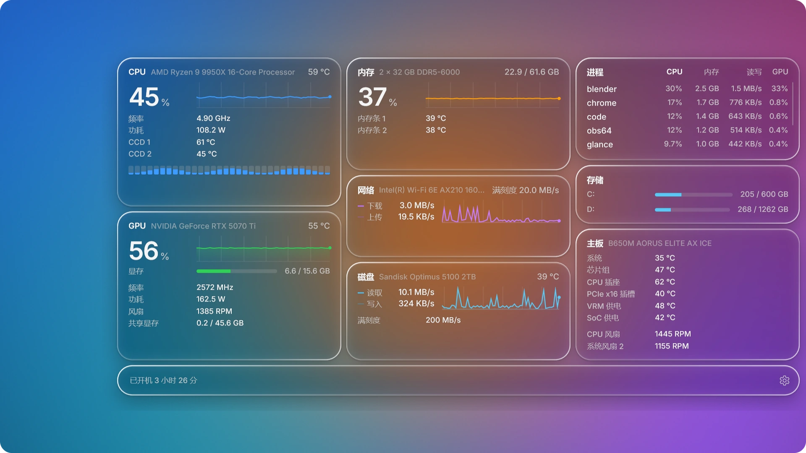
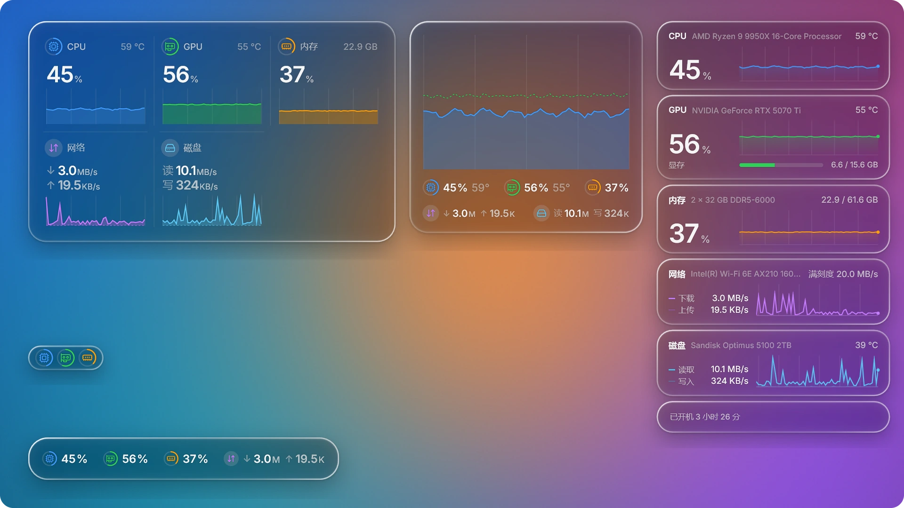
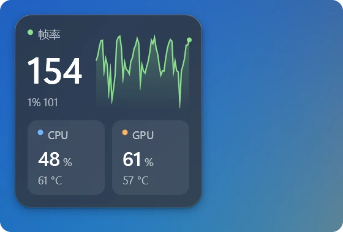
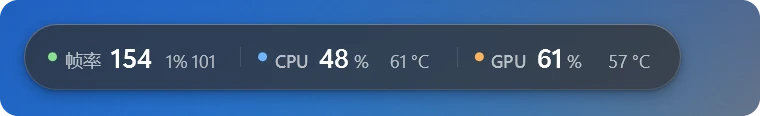
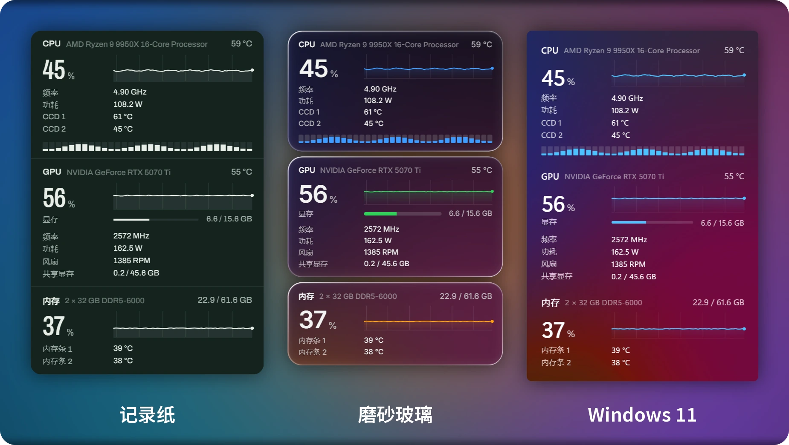

[](#许可证)
[](https://github.com/lulu-loopp/glance/releases/latest)
[](https://github.com/lulu-loopp/glance/releases)
[](#安装)

Glance 是一个免费开源、不打扰你的 Windows 系统监控。把鼠标推到屏幕边缘，面板滑出，电脑此刻的状态一目了然；移开鼠标，面板收回。

[官网](https://glancepc.com) · [English](README.md) · [下载](https://github.com/lulu-loopp/glance/releases/latest)（[国内镜像](https://gitee.com/lulu-loopp/glance/releases)） · [硬件支持](#硬件支持) · [构建](#构建)



## 显示什么

- **CPU**：占用、每个线程、频率、温度、封装功耗、每个 CCD 的温度
- **GPU**：占用、显存、频率、温度、风扇，以及 NVIDIA 和 AMD 独立显卡的功耗
- **内存**：用量，以及每根内存条的温度
- **网络和磁盘**：流量，以及硬盘温度
- **进程**：按 CPU、内存、读写或 GPU 排序的最忙程序
- **存储**：每个分区的空间
- **主板**：各处温度和风扇转速
- **电池**：笔记本上显示电量、充放电功率（拔掉电源时就是整机耗电）和电池健康度
- **游戏**：全屏游戏运行时自动出现在最上面：帧率、1% low、帧时间图、屏幕刷新率，游戏自己占用的 CPU、GPU、内存和显存，显卡是否撞上功耗墙或温度墙（NVIDIA），这次玩了多久，以及麦克风是否静音

## 桌面小组件

把面板从屏幕边缘拖开，它就会被"撕"下来，变成留在桌面上的小组件。拖任意一条边或一个角调整大小，内容会按空间自动排版：面板原来的各栏、方块、上面是曲线下面是读数的卡片、横条，或者几个小圆环，形态之间平滑过渡。拖到屏幕边缘附近，会提示它将停靠的位置；松手后它会变成细长的横条或竖条贴在边上，并停在你松手处的正中。把它甩出屏幕就会收起，托盘菜单可以召回。鼠标移上去会出现几个按钮：立即显示游戏读数（Glance 没认出来的游戏也可以）、设置、固定位置和大小的图钉，以及关闭。右键菜单里可以开启鼠标穿透（点击会落到后面的窗口，按住 Ctrl 才能操作它）；取消"置于其他窗口之上"，它就留在桌面上，被其他窗口盖住，按 Win+D 显示桌面时和桌面一起出现；也可以收起，或打开设置。Glance 重启后小组件会回到原来的位置，外观与面板一致。



## 悬浮窗

几项读数浮在屏幕上，可以一直显示，也可以只在玩游戏时出现。布局有两种：卡片（帧率放大显示，旁边是最近一分钟的帧率曲线，其余读数排成小格）和横条（一到三行）。读数放在一块磨砂玻璃上：背后的画面会被模糊，玻璃按周围画面的明暗自动选深色或浅色，着色只加到每个数字都看得清为止（Windows 10 上没有模糊，只有着色）。拖动它调整位置，拖边角调整大小，右键可以锁定位置或关闭。显示项目和面板一样按组设置：帧率、CPU、GPU、内存、显存、下载和上传、麦克风，每组里的项目可以单独开关，拖动可以调整顺序。





帧率来自 Windows 自带的事件跟踪：不往游戏里注入任何东西，也从不打开游戏进程，不会触碰反作弊。目前支持 DirectX 游戏，Vulkan 和 OpenGL 游戏暂不显示帧率。

## 三种外观

记录纸、磨砂玻璃（每一块面板的边缘都会折射背后的桌面）和 Windows 11（与开始菜单相同的亚克力材质）。可选浅色、深色，或跟随壁纸亮度自动切换。界面支持中文和英文。



## 小巧安静

程序只有一个约 1 MB 的可执行文件，用 Direct2D 和 DirectComposition 原生绘制。面板收起时约占 55 MB 内存，CPU 占用远低于一个核心的 1%。不需要账号，没有广告；除每天向 GitHub 和 Gitee 查询一次新版本外不联网，这项检查可以在设置中关闭。

## 安装

1. 从[最新版本](https://github.com/lulu-loopp/glance/releases/latest)下载 `Glance_<版本>_x64-setup.exe` 并运行。GitHub 打不开时，可以从 [Gitee 镜像](https://gitee.com/lulu-loopp/glance/releases)下载同一个安装程序。
2. 安装程序已签名（发布者：Weiyi Shi）。由于签名刚开始使用，最初的一段时间里 Windows SmartScreen 仍可能提示“Windows 已保护你的电脑”，点击“更多信息”→“仍要运行”即可。
3. Glance 第一次启动时会请求一次管理员权限：读取温度、功耗和风扇需要它，通过安装程序装好的已签名驱动 [PawnIO](https://github.com/namazso/PawnIO) 完成。此后启动不再询问，也可以设置为开机时启动。

**安装位置。** 只有安装在普通程序无法修改的文件夹里，Glance 才会不经询问地以管理员身份启动：默认的 Program Files，或磁盘根目录下的新文件夹（例如 `D:\Glance`）。选择其他位置时，安装程序会说明影响；装在那里的 Glance 每次启动都需要确认管理员权限，也无法开机时启动。

## 使用

- **打开面板**：把鼠标推向屏幕右边缘（推向哪一侧、需要多大力度、面板出现在什么位置、分几栏、面板大小，都可以在设置中调整；推边缘也可以关闭）。需要有意识地推一下才会打开，所以屏幕边缘的滚动条照常可用。也可以按 **Ctrl+Alt+G**（快捷键可以自定义），在鼠标所在位置打开面板，再按一次收起。
- **玩游戏时**：全屏游戏运行时，面板最上面会自动出现"游戏"一栏；想在游戏画面上看帧率，就在设置的"悬浮窗"页打开"游戏时自动显示"。全屏和无边框全屏的游戏里，设置可以选择怎样呼出面板（默认仅快捷键，免得游戏中鼠标碰到边缘误触）。显示模式设为"全屏"的游戏，只要有东西盖上去就会暂时切出，这是 Windows 的机制，面板收起后游戏会自动回来；窗口模式的游戏里，面板照常叠在游戏上。
- **选择显示内容**：在设置里，每个模块（CPU、每张显卡、内存、网络、硬盘……）都能展开，里面每一项单独开关；拖动模块可以调整顺序。
- **收起面板**：把鼠标移开，或按 Esc。
- **调整大小**：面板打开后就可以拖它的边角调整大小。
- **留在桌面上**：把面板从屏幕边缘拖开，它会变成小组件留在桌面上（见[桌面小组件](#桌面小组件)），也可以拖到另一块屏幕。
- **固定面板**：点面板底栏的图钉，面板会一直显示，方便边做别的事边看。
- **随时一瞥**：鼠标悬停在托盘图标上，会显示 CPU、显卡和内存的简要读数。开启“过热提醒”（默认关闭）后，CPU 或显卡持续 30 秒达到温度警示值时，托盘会弹出提醒。
- **设置**：右键单击托盘图标，或再次启动 Glance。设置窗口也可以用键盘操作（Tab、方向键、空格）。
- **更新**：Glance 每天向 GitHub 和它在 Gitee 的镜像查询一次新版本，哪边连得上就用哪边。有新版本时，托盘会提示，设置中会出现更新按钮。Glance 下载安装程序后，只有确认其签名与当前 Glance 出自同一发布者，才会运行它。
- **卸载**：在“设置 → 应用 → 已安装的应用”中卸载，或在 Glance 的设置中卸载。卸载会删除 Glance、它的计划任务和设置，并询问是否一并卸载 PawnIO 驱动（其他监控软件可能也在使用它）。

## 硬件支持

| | 支持 | 已在真机上验证 |
|---|---|---|
| CPU | AMD Ryzen（Zen 及以后）、Intel Core | AMD Ryzen 9 9950X |
| 主板传感器 | ITE 和 Nuvoton（NCT67xx，以及微星常用的 NCT6683/6686/6687）Super I/O 芯片 | ITE IT8689E |
| 内存温度 | 带传感器的 DDR4 和 DDR5 内存条 | DDR5 |
| 显卡功耗 | NVIDIA（NVML）、AMD（ADL）独立显卡 | NVIDIA RTX 5070 Ti |
| 其他读数 | 通过 Windows 获取（与任务管理器相同的数据来源） | |

欢迎 Intel 和 Nuvoton 机器的用户反馈实际效果：在“设置 → 系统 → 诊断信息”中点“复制”，Glance 会把识别到的硬件、读数情况和最近的日志复制到剪贴板，直接粘贴到 issue 即可（不包含路径或用户名）。日志文件是设置旁边的 `%APPDATA%\dev.weiyi.glance\glance.log`。笔记本的风扇和主板温度由笔记本自己的嵌入式控制器管理，Glance 暂不显示（华硕笔记本的风扇除外，由固件提供）；核显的功耗包含在 CPU 封装功耗里，在 CPU 一栏中显示。

## 构建

```
cargo build --release
makensis installer\glance.nsi
```

`scripts\release.ps1` 会完成以上两步；加上 `-Sign` 时，还会为可执行文件、卸载程序和安装程序签名（`scripts\sign.ps1`，使用 Microsoft Artifact Signing）。调试版本启动时不请求管理员权限，因此也没有驱动提供的传感器读数。

本页的图片和宣传视频都由 Glance 自己绘制：`cargo build --release --features studio` 会加入 `glance --studio script.json out-folder` 命令，按镜头脚本在屏幕外逐帧渲染面板，再由 `studio\readme.py` 和 `studio\compose.py` 合成（见 `studio\`）。

## 许可证

Glance 以 MIT 许可证发布（[LICENSE](LICENSE)）。它附带或内置的第三方软件遵循各自的许可证：PawnIO 驱动安装程序（GPL-2.0，附例外条款；源代码随每个版本一并发布）、PawnIO 模块（LGPL-2.1，源代码位于 `pawnio-modules/source`）、Archivo 和 Inter 字体（OFL 1.1），以及 Rust 依赖库；详见 [licenses/THIRD-PARTY.txt](licenses/THIRD-PARTY.txt)。
